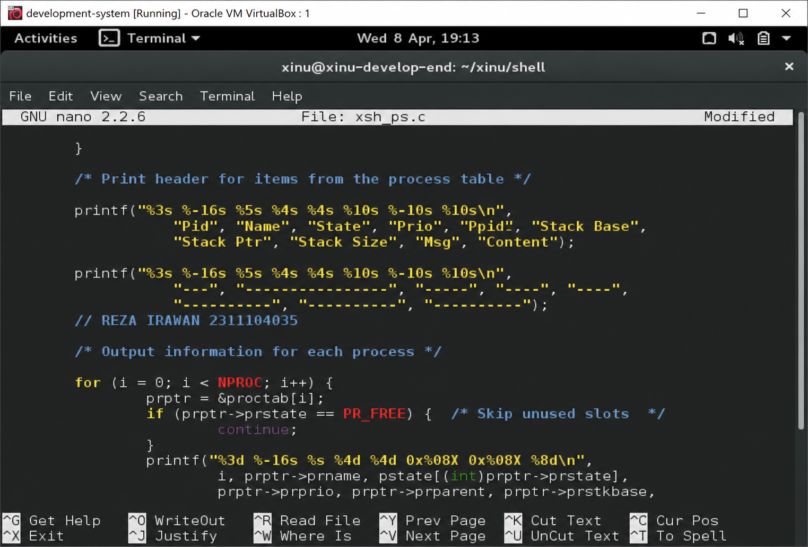
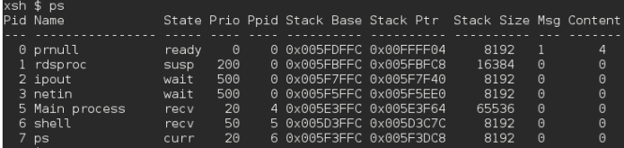
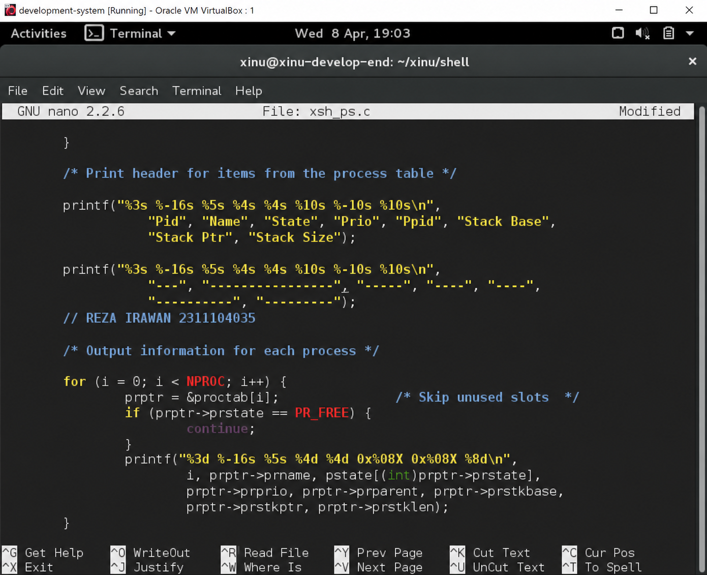
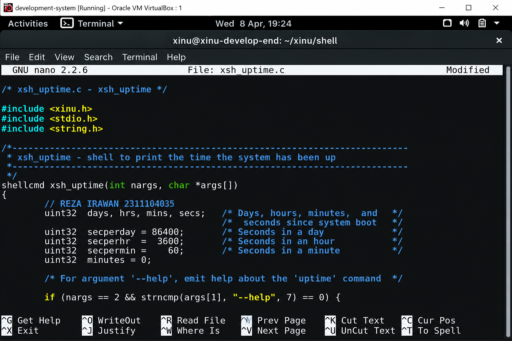
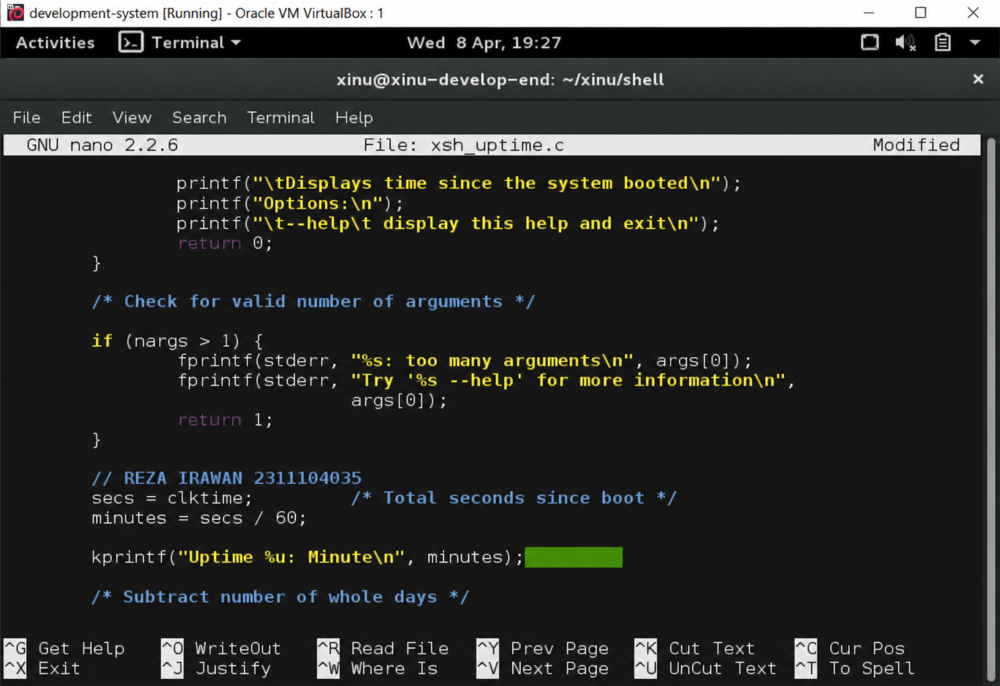

<h1 align="center">Laporan Praktikum Modul 05   Eksplorasi Proses</h1>

 Reza Irawan – NIM 2311104035 

## Dasar Teori

Xinu (Xinu Is Not Unix) adalah sistem operasi yang dirancang secara khusus oleh Douglas Comer dengan arsitektur yang berfokus pada kejelasan dan kesederhanaan, menjadikannya subjek yang sangat ideal untuk studi literatur kode. Berbeda dengan sistem operasi modern yang memiliki jutaan baris kode kompleks, source code Xinu sengaja ditulis secara ringkas, terstruktur rapi, dan sangat transparan. Pendekatan ini memungkinkan pelajar untuk secara langsung membaca, menelusuri, dan membedah logika pemrograman dari komponen-komponen inti sistem operasi seperti manajemen memori, penjadwalan proses, dan manajemen device. Dengan membaca source code Xinu, pemahaman teoretis mengenai sistem operasi dapat diubah menjadi wawasan praktis, di mana mekanisme tingkat rendah (low-level) dapat dianalisis dan dipahami instruksi demi instruksinya.

## Guided

Pada kali ini saya mengerjakan jurnal, memahami proses pada Xinu dan Konfigurasi Pada Source Trail.

## Jurnal
1.Jawablah pertanyaan berikut ini: a. Berapa banyaknya maksimum proses yang ada pada Xinu? = 50 proses b. Berapa maksimal panjang nama suatu proses pada Xinu? = 16 karakter (termasuk null terminator) c. Berapa nilai prioritas awal pada saat proses dibuat? = saat paki create(), default priority biasanya: 20 d. Ada berapa total state pada Xinu? Sebutkan! = 7 state

2.Perintah ps adalah perintah untuk menampilkan statistik process yang berjalan. Source code dari ps tersimpan pada file xsh_ps.c. Carilah file tersebut dan beri komentar pada 20 baris terakhir di source code tersebut!

3.Ubahlah perintah ps (source code: xsh_ps.c) pada Xinu sehingga menampilkan informasi tambahan berupa kolom yang berisi total message yang ada pada proses seperti gambar di bawah ini:

Kolom Msg adalah banyaknya pesan yang ada dalam proses. Kolom Content adalah isi dari pesan tersebut. Langkah pengerjaan:

Jawab:

4.Ubahlah perintah uptime pada Xinu sehingga menampilkan lamanya Xinu sejak booting hanya dalam satuan menit.

## Referensi

1. https://en.wikipedia.org/wiki/Data_structure
2. ChatGPT