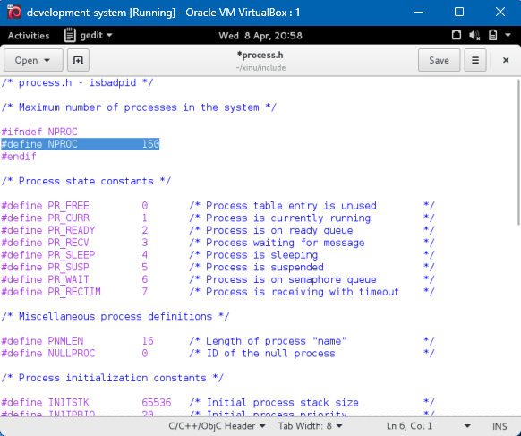
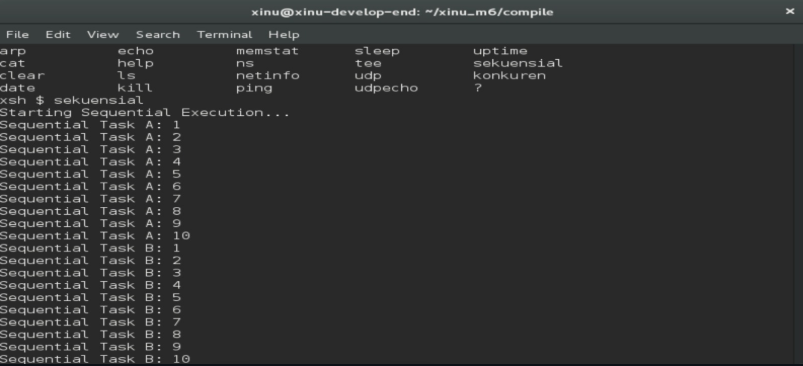
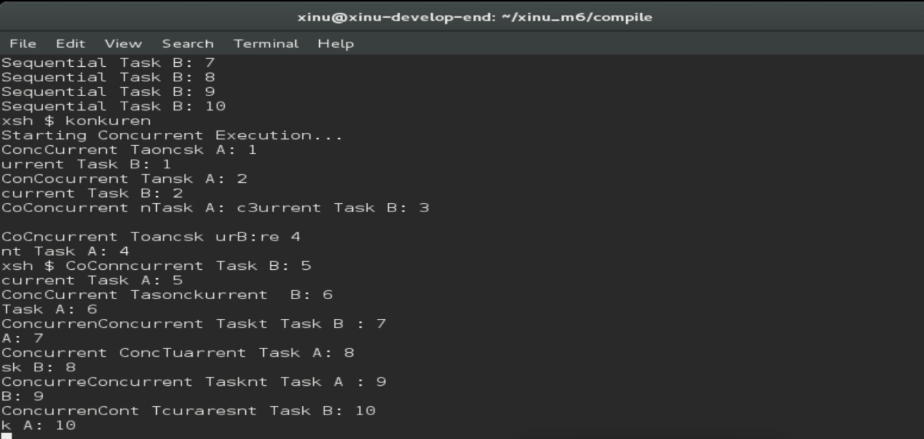
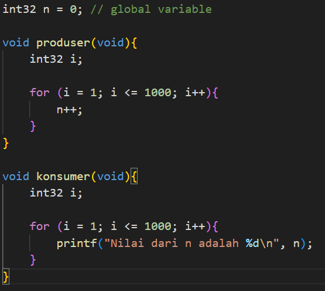
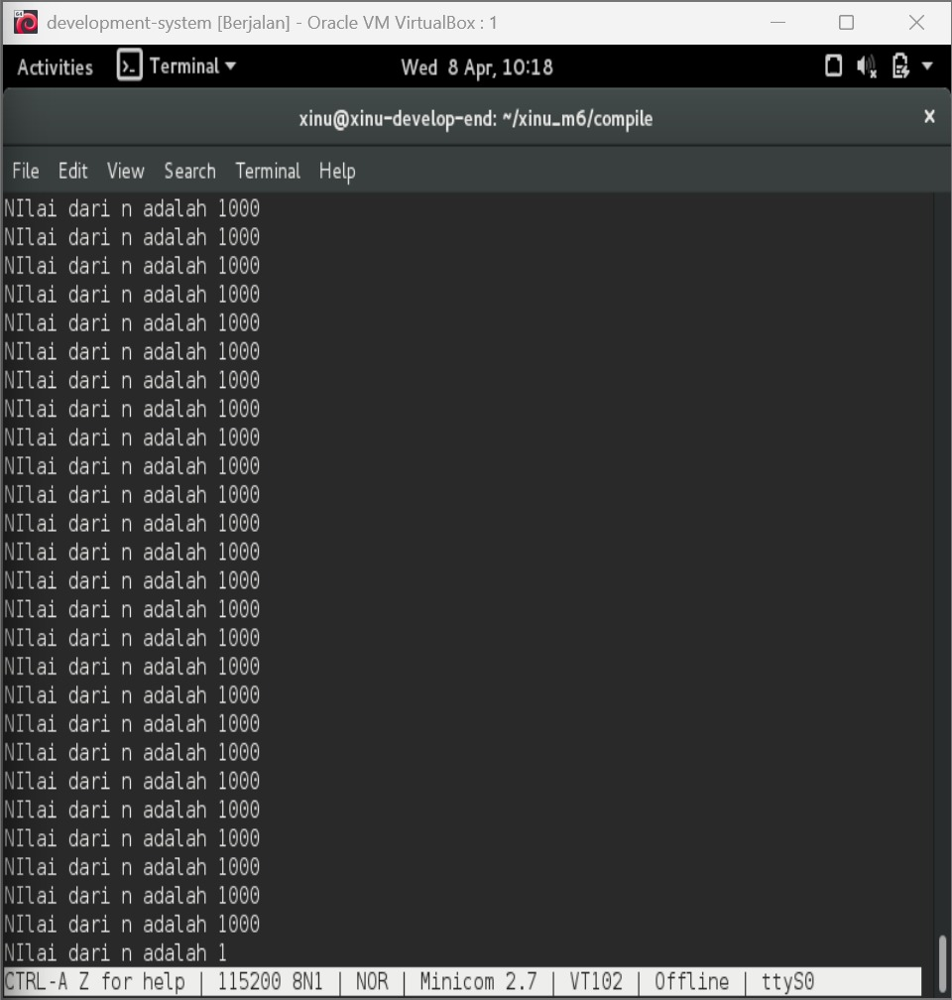

# <h1 align="center">Laporan Praktikum Modul 6  Sekuensial dan Konkuren </h1>

Reza Irawan - 2311104035

## Dasar Teori
 ### Pendahuluan
Dalam Sistem Operasi, terdapat dua konsep utama dalam eksekusi program, yaitu sekuensial dan konkuren. Program sekuensial dijalankan secara berurutan, di mana setiap instruksi dieksekusi satu per satu sesuai alur kode. Pada model ini, CPU hanya menangani satu proses dalam satu waktu, sehingga apabila terdapat fungsi dengan perulangan tak hingga, maka bagian program lain tidak akan pernah dijalankan. Hal ini terlihat pada implementasi di Xinu, di mana fungsi seperti sndA() yang berjalan terus-menerus akan menghambat eksekusi fungsi lain seperti sndB(), sehingga program tidak berjalan secara bersamaan. Sebaliknya, konsep konkuren memungkinkan beberapa proses berjalan secara bersamaan melalui mekanisme yang diatur oleh sistem operasi. Pada sistem dengan satu CPU, konkurensi dicapai menggunakan teknik time slicing dalam Multitasking, sehingga CPU berpindah dengan cepat antar proses dan menciptakan ilusi paralelisme. Dalam Xinu, proses baru dapat dibuat menggunakan system call create() dan dijalankan dengan resume(), sehingga beberapa proses seperti pencetakan karakter “A” dan “B” dapat berjalan bergantian. Pendekatan ini meningkatkan efisiensi penggunaan CPU dan memungkinkan sistem menangani banyak tugas secara lebih optimal dibandingkan metode sekuensial.

## Jurnal

### 1. 
Selain hardware (memory), batasan maksimal proses dapat ditentukan dengan secara software. Pada Linux maksimal proses adalah 4194303 proses (64 bit) dan 32767 proses (32 bit) dapat dilihat melalui perintah $cat /proc/sys/kernel/pid_max
Carilah pada source code Xinu yang memberi batasan mengenai banyaknya proses yang bisa dibuat.

Maksimal proses pada Xinu: 8 proses
ubah menjadi: 150 proses
   

## 2. 
Jalankan kode sekuensial!

## 3.  
Jalankan kode konkuren!

## 4. 
Buatlah 2 proses produser dan konsumer.

Produser memproduksi angka integer dari 1–1000
Konsumer mengkonsumsi integer yang diproduksi oleh produser dan menampilkannya
Gunakan variabel global bertipe int32 bernama n yang digunakan bersama oleh kedua proses.

## input:

## output:

## Referensi
1.https://en.wikipedia.org/wiki/Data_structure
2.Modul Praktikum Sistem Operasi