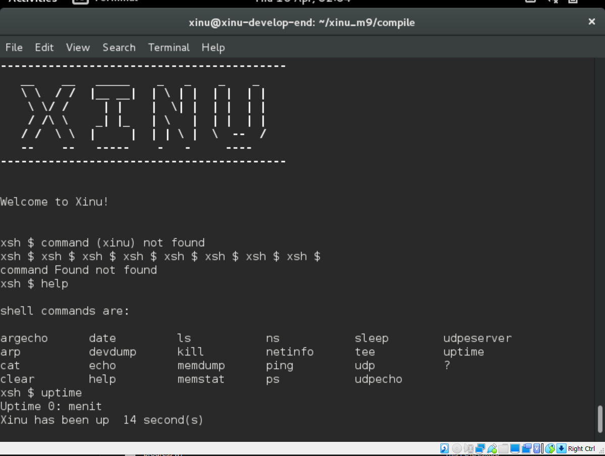
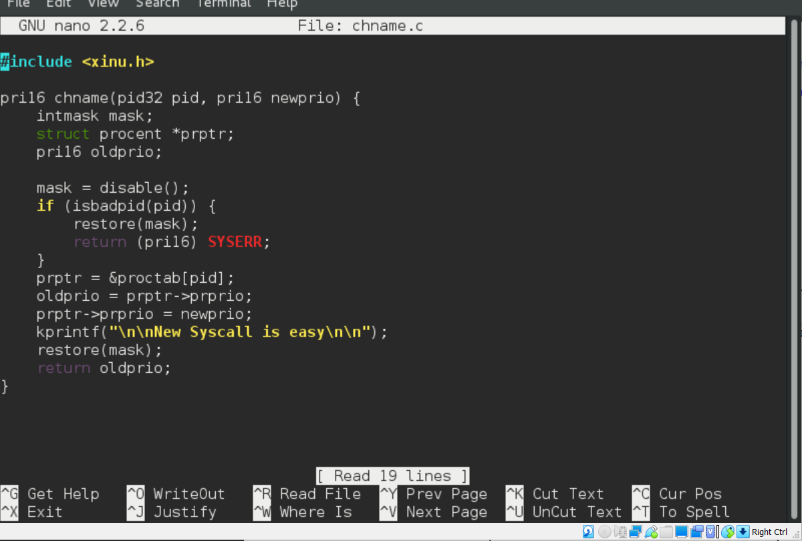
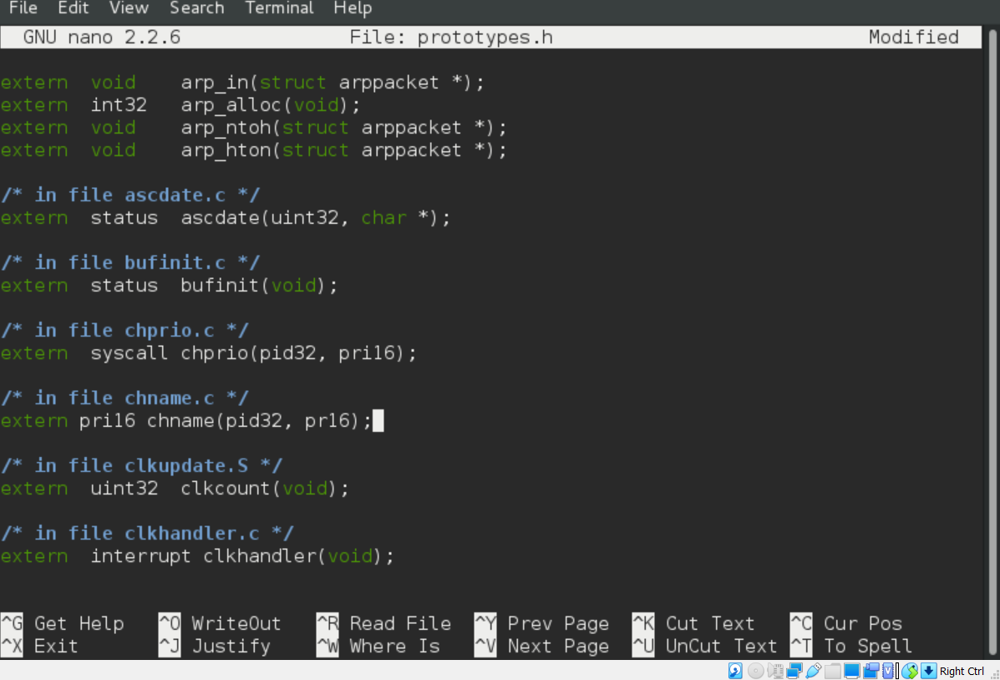
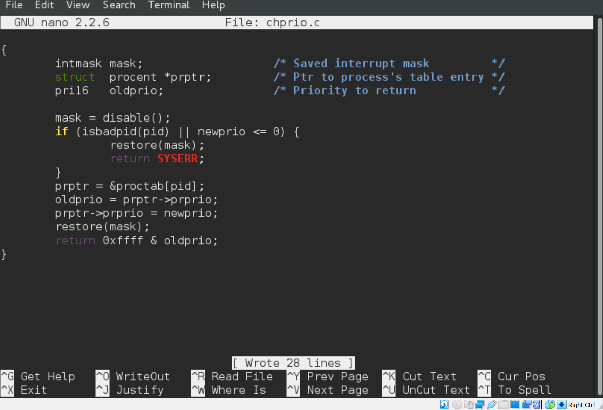
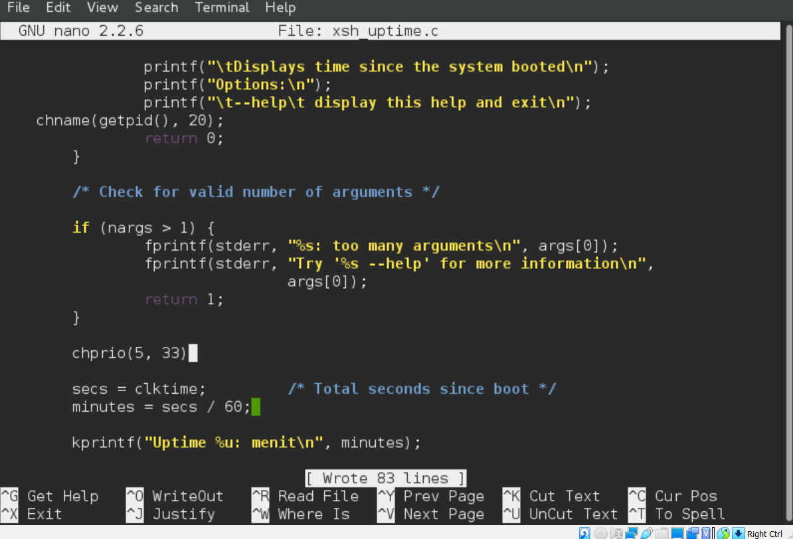
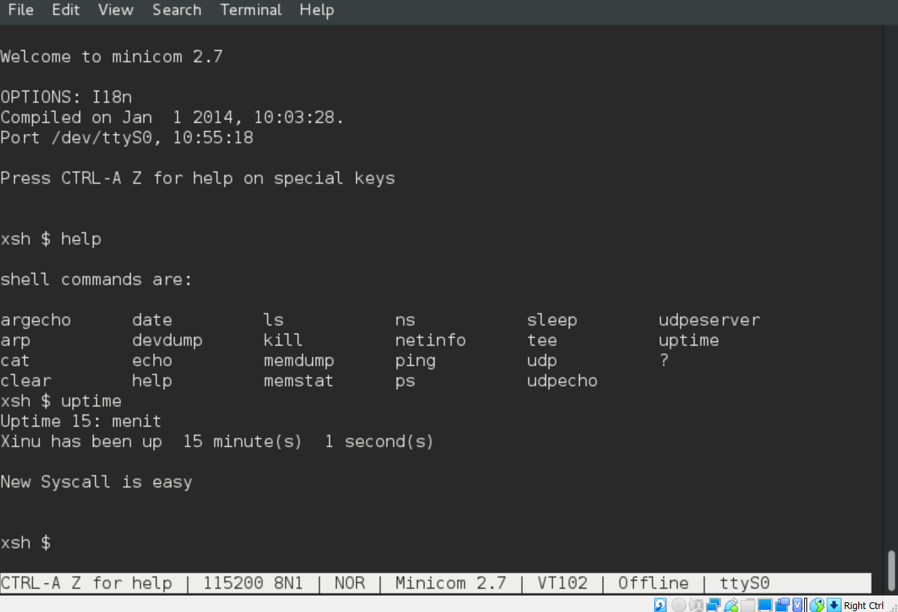
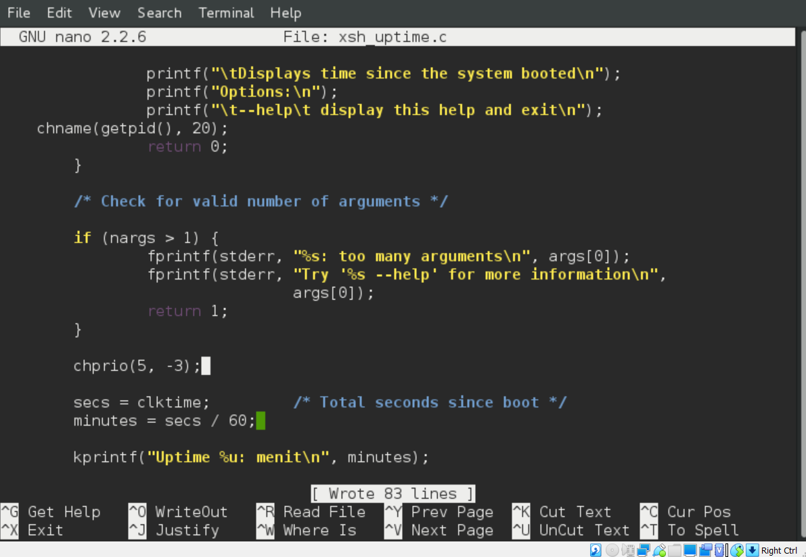
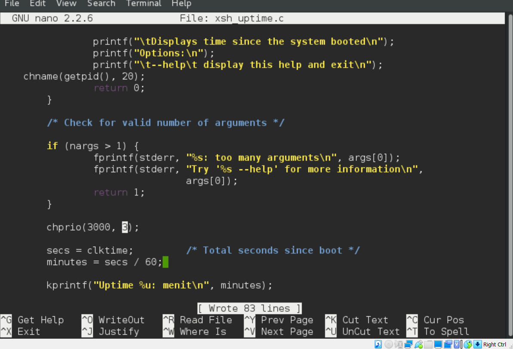
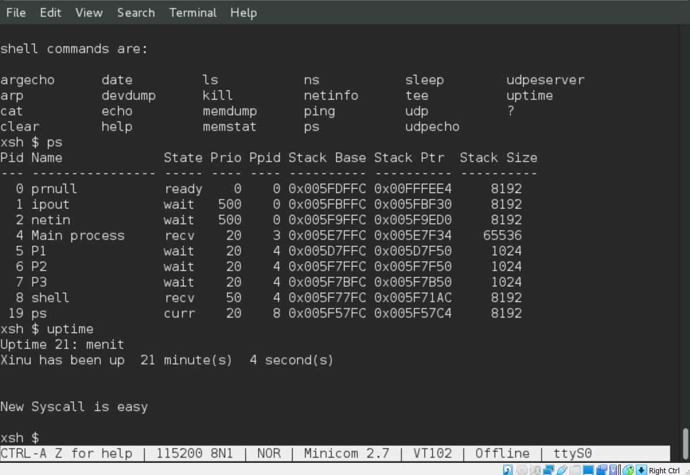

# <h1 align="center">Laporan Praktikum Modul 09  Syscall Xinu</h1>

Reza Irawan - 2311104035

## Dasar Teori

Source code syscall pada Xinu secara khusus terletak di direktori ../system. Direktori ini berisi implementasi dari berbagai panggilan sistem yang memungkinkan program pengguna berinteraksi dengan kernel sistem operasi.

Berikut adalah penjelasan lebih lanjut mengenai opsi-opsi lain:

Opsi A:../system adalah jawaban yang benar karena direktori ini secara khusus menyimpan implementasi dari panggilan sistem (syscall) dalam Xinu. Opsi B:../shell biasanya berisi kode yang berkaitan dengan shell Xinu, yaitu antarmuka baris perintah yang digunakan untuk berinteraksi dengan sistem operasi. Opsi C:./include berisi file header yang mendefinisikan struktur data, konstanta, dan deklarasi fungsi yang digunakan di seluruh sistem operasi, tetapi bukan implementasi dari syscall. Opsi D:./header bukan direktori standar dalam struktur Xinu.

## Guided
Berikut hasil tampilan saat Xinu berhasil dijalankan:

## Jurnal

## 1.

## 2. 

## 3. 

## 4. 

## Referensi
1. Modul Praktikum Sistem Operasi – Modul 9: Syscall