# <h1 align="center">Laporan Praktikum Modul 15  Keamanan Linux</h1>

Reza Irawan - 2311104035

## Dasar Teori

> Keamanan informasi merupakan upaya untuk menjaga kerahasiaan (confidentiality), integritas (integrity), dan ketersediaan (availability) data. Pada Linux, integritas data dapat diperiksa menggunakan fungsi hash seperti MD5, SHA256, dan SHA512 yang menghasilkan nilai unik berdasarkan isi file. Untuk menjaga kerahasiaan data, Linux menyediakan berbagai mekanisme enkripsi seperti EncFS untuk mengenkripsi direktori dan GPG (GNU Privacy Guard) untuk mengenkripsi pesan menggunakan sistem kunci publik dan privat. Dengan teknik tersebut, perubahan sekecil apa pun pada data dapat dideteksi melalui hash, sedangkan akses terhadap data rahasia dapat dibatasi hanya kepada pihak yang memiliki kunci yang sesuai.

## Unguided

1.  Integritas: dasar hashing [10 Point]

    **a.[2 Point] Lakukan hash SHA256, SHA512 dan MD5 untuk file /etc/passwd. Berapa nilai hash dari file /etc/passwd? Screenshot nilai hash dari file tersebut.**

    > 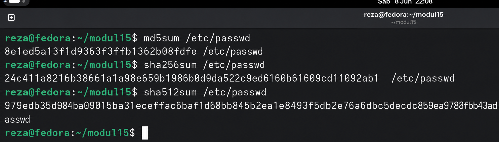

    **b. [2 Point] Buatlah file bernama test_0.txt pada folder /home/praktikan. Isi file tersebut isi yang ada di file /etc/passwd (copy paste isi file /etc/passwd ke test_0.txt)**

    > 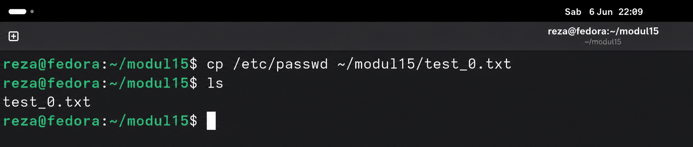

    **c.[2 Point] Lakukan hash SHA256, SHA512 dan MD5 untuk file test_0.txt. Berapa nilai hash dari file test_0.txt? Screenshot nilai hash dari file test_0.txt.**

    > 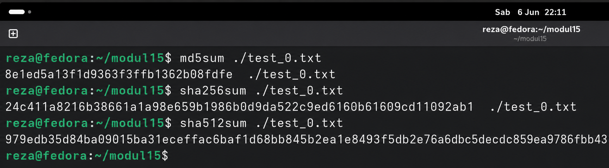

    **d.[2 Point] Rename file test_0.txt menjadi file_0.txt. Lakukan hash SHA256, SHA512 dan MD5 untuk file_0.txt. Berapa nilai hash file_0.txt? Screenshot nilai hash dari file_0.txt.**

    > 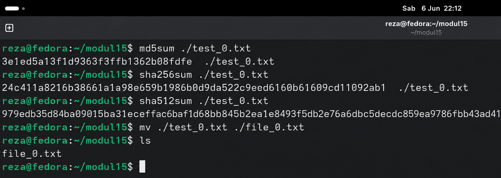

    **e.[2 Point] Apa hasil pengamatan Anda? File apa saja yang mempunyai hash yang sama? Jelaskan!**

    > File /etc/passwd, test_0.txt, dan file_0.txt memiliki nilai hash yang sama karena isi ketiga file tersebut identik. Perubahan nama file tidak mempengaruhi nilai hash karena hash dihitung berdasarkan isi file, bukan nama file.

2.  Integritas: avalance [15 Point]

    **a. [3 Point] Download file bernama test_1.txt di link ini tiny.cc/test1_txt**

    > file sudah didownload via wget

    **b. [3 Point] Lakukan hash SHA256, SHA512 dan MD5 untuk file test_1.txt. Berapa nilai hash test_1.txt? Screenshot nilai hash dari file test_1.txt.**

    > 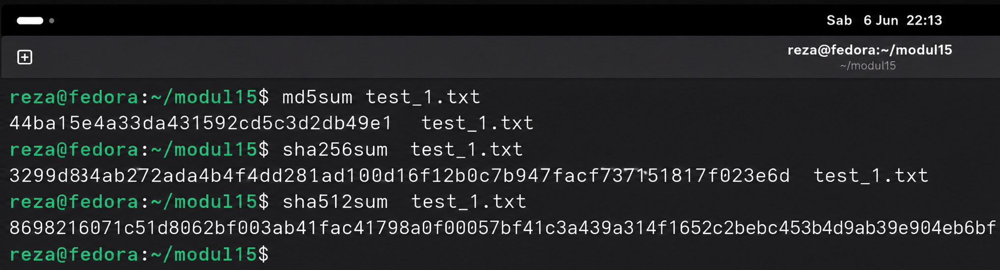

    **c. [3 Point] Hapuslah titik diakhir file test_1.txt tersebut, simpan file tersebut!**

    > 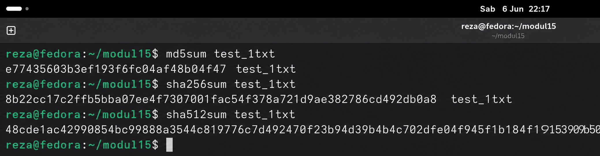

    **d. [3 Point] Lakukan hash dari SHA256, SHA512 dan MD5. Screenshot nilai hash dari file test_1.txt.**

    > 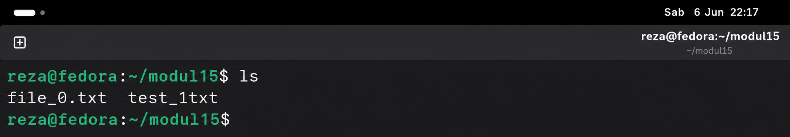

    **e. [3 Point] Apa analisis (hasil pengamatan) Anda mengenai hal tersebut! Apakah nilai hash sama?**

    > Nilai hash sebelum dan sesudah penghapusan satu karakter berbeda secara signifikan. Hal ini menunjukkan sifat Avalanche Effect pada fungsi hash, yaitu perubahan yang sangat kecil pada data masukan dapat menghasilkan perubahan yang sangat besar pada nilai hash.

3.  Integritas: avalance [15 Point]

    **a. [3 Point] Download file bernama test_1.doc di link ini tiny.cc/test1_doc**

    > 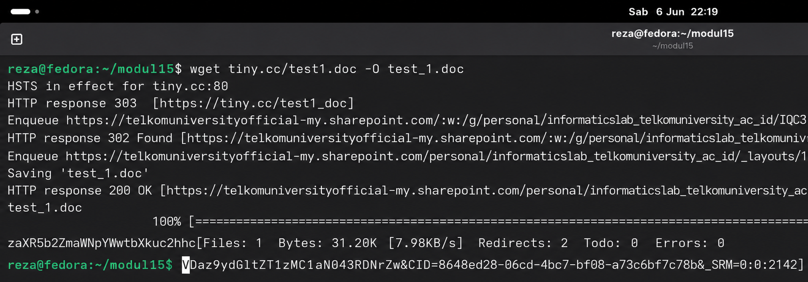

    **b. [3 Point] Lakukan hash SHA256, SHA512 dan MD5 untuk file test_1.doc. Screenshot nilai hash dari file test_1.doc.**

    > 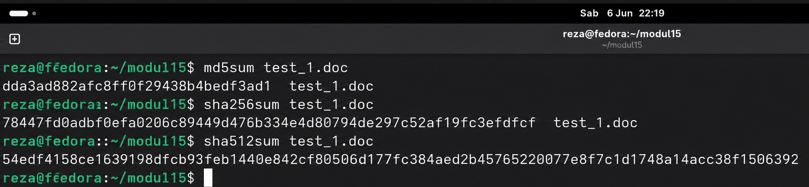

    **c. Buka kembali file test_1.doc. Lakukan hal ini:** 
    _i. [3 Point] Ketik abcdef. Save test_1.doc_ 

    > 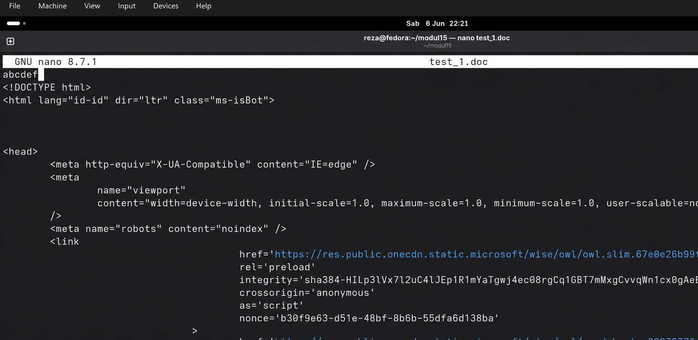

    _ii. [3 Point] Hapus abcdef. Save test_1.doc_

    > 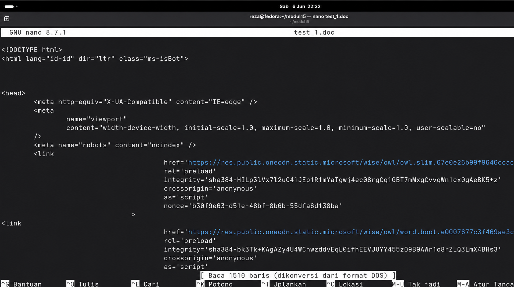

    **d. [3 Point] Lakukan hash SHA256, SHA512 dan MD5 untuk file test_1.doc. Screenshot nilaihash dari file test_1.doc.**

    > 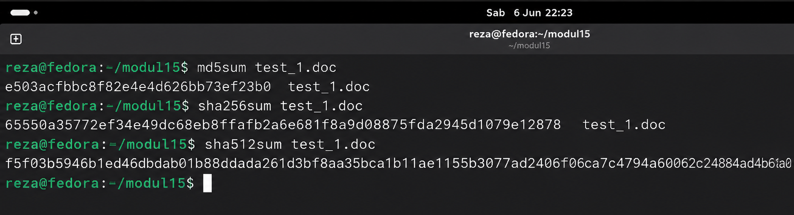

    **e. [3 Point] Hasil pengamatan apa yang diperoleh? Jelaskan alasannya!**

    > Nilai hash setelah file diedit dan disimpan kembali berbeda dengan hash sebelumnya meskipun isi teks akhirnya terlihat sama. Hal ini disebabkan oleh perubahan metadata atau struktur internal file yang terjadi saat proses penyimpanan ulang dokumen.

4.  Konfidensialitas: encfs [27 Point]

    **a. [5 Point] Jalankan perintah berikut: encfs ~/folder_anda/folder_terenkripsi ~/folder_anda/folder_normal Pilih y (enter), pilih y (enter), enter, kemudian buatlah password. Ingatlah password yang dibuat. Setelah selesai, perhatikan bahwa telah muncul folder bernama folder_normal dan folder_terenkripsi.**

    > 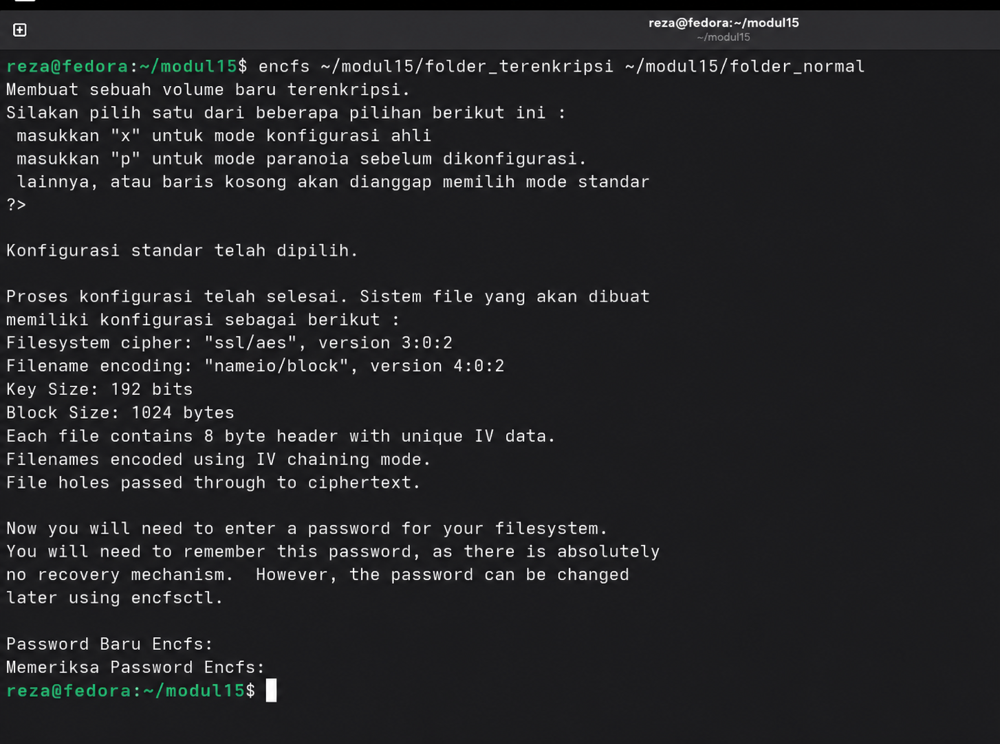

    > **b. [5 Point] Copy dua atau tiga buah file (file apa saja) ke folder_normal. Amati dan tulis hasil observasi Anda pada folder_terenkripsi!**

    > 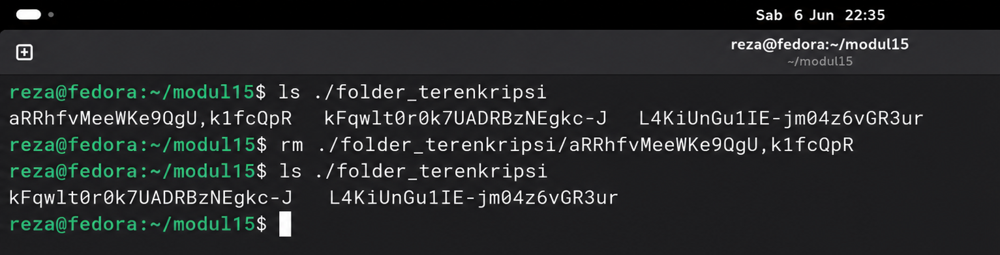
    > File yang disalin ke folder_normal akan muncul pada folder_terenkripsi dalam bentuk terenkripsi sehingga nama maupun isi file tidak dapat dibaca secara langsung.

    > **c. [5 Point] Hapus salah satu file (bebas) pada folder_terenkripsi. Amati dan tulis hasil observasi Anda pada folder_normal!**

    > 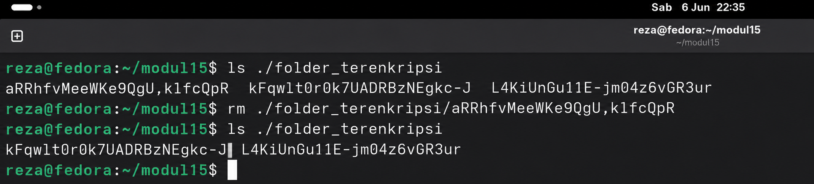
    > File yang dihapus dari folder_terenkripsi juga akan hilang dari folder_normal karena kedua folder merepresentasikan data yang sama.

    > **d. [5 Point] Lakukan umount dengan perintah: Fusermount -u ~/folder_anda/folder_normal Amati dan tulis hasil observasi Anda pada folder_normal dan folder_terenkripsi**

    > 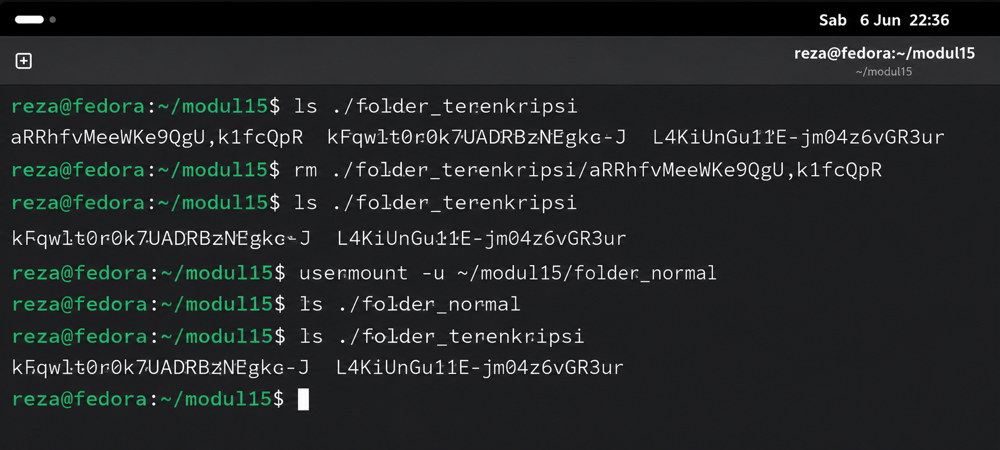
    > Setelah dilakukan unmount, folder_normal tidak lagi menampilkan file yang telah didekripsi, sedangkan folder_terenkripsi tetap menyimpan data dalam bentuk terenkripsi.

    > **e. [7 Point] Buatlah folder baru bernama folder_sembarang. Lakukan perintah berikut ini: encfs ~/folder_anda/folder_terenkripsi ~/folder_anda/folder_sembarang Amati dan tulis hasil observasi Anda!**

    > 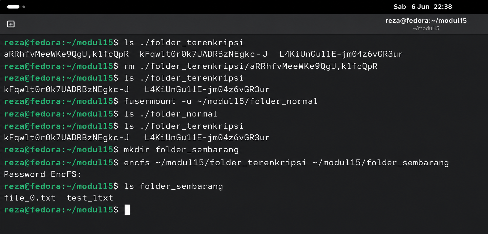
    > Setelah memasukkan password yang benar, file dapat kembali diakses dalam bentuk normal melalui folder_sembarang. Hal ini menunjukkan bahwa data terenkripsi dapat dipulihkan menggunakan password yang sesuai.

5.  Konfidensialitas: gpg [30 Point]

    **a. [5 Point] Membuat kunci publik dan privat. Jalankan perintah ini: gpg --gen-key Baca dan ikuti perintah yang ada dari program gpg!**

    > 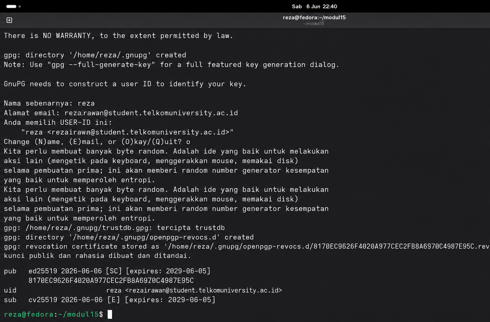

    **b. [5 Point] Hasil publickey dan privatekey ada di folder ~/.gnupg. Privatekey tidak bolehkeluar dari komputer ini dan hanya Anda saja yang dapat mengaksesnya. Kunci publikakan dibagikan kepada seluruh dunia atau untuk orang yang Anda inginkan saja. Kunci publik adalah pubring.gpg dan kunci private adalah secring.gpg Lakukan perintah berikut ini untuk mengetahui daftar key yang Anda punya dan fingerprint kunci yang Anda punya! gpg –-list-keys gpg –-fingerprint nama@email.com Screenshot hasil perintah di atas!**

    > 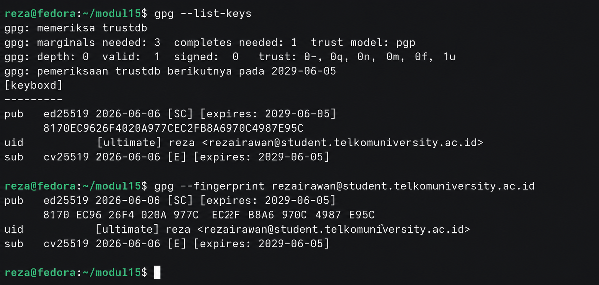

    **c. [5 Point] Export kunci publik Anda. Jalankan perintah ini: gpg –-armor –-export nama@email.anda > mypublic_key.asc File mypublic_key.asc adalah file yang akan dibagikan kepada teman-teman Anda. Teman Anda akan menggunakan kunci publik Anda jika ingin mengirim pesan rahasia kepada Anda. Hanya Anda yang dapat membaca pesan tersebut karena hanya mempunyai kunci privat yang bersesuaian dengan kunci publik Anda.** 
    i. Rename mypublic_key.asc menjadi nim_anda.asc, Contoh: 130118xxxx.asc\*\* 

    > 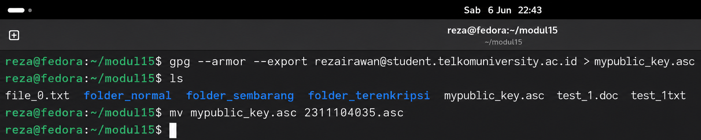

    **ii. Taruh file nim_anda.asc ke folder pada link berikut: http://tiny.cc/SisopNomor5C**

    > 

    **d. [5 Point] Mengimport kunci publik orang lain. Silakan download file nim_teman_sebelah_anda.asc dan jalankan perintah ini untuk mengimport (menambahkan kunci publik orang lain ke sistem Anda): gpg –-import nim_teman_sebelah_anda.asc Contoh: “gpg --import 130118yyyy.asc” Setelah mengimport kunci publik teman Anda, Anda dapat mengirimkan pesan kepada teman Anda secara terenkripsi. Untuk memastikan bahwa kunci publik telah diimport lakukan perintah gpg –-list-keys dan nama teman Anda ada pada hasil perintah tersebut.**

    > 

    **e. [5 Point] Enkripsi pesan.**

    > 

    **f. [5 Point] Hanya teman anda yang dapat membuka file tersebut. Hasil dari proses tersebut adalah file_rahasia_untuk_teman_anda.asc (contoh: file_rahasia_untuk_130118yyyy.asc) Taruh file_rahasia_untuk_teman_anda.asc ke folder pada link: http://tiny.cc/SisopNomor5F Download dan buka file yang diperuntukkan bagi Anda dan lakukan dekripsi untuk melihat isi pesan dengan perintah: gpg file_rahasia_nim_anda.asc**

    > 

